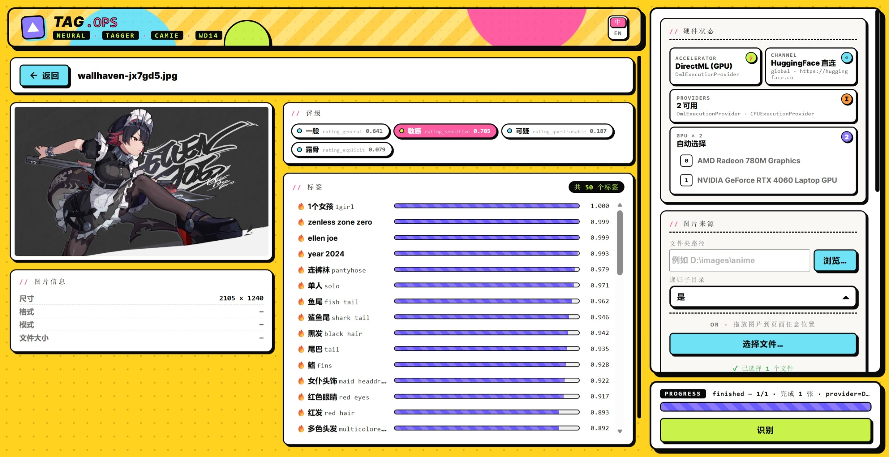

[English](README.md) | [中文](README_zh.md)

<p align="center">
  
</p>

# TAG.OPS

A local-first anime image auto-tagging workbench. Easily drop a folder or images to generate tags using WD14 and Camie-tagger-v2 models, organize them, and save the results.

<p align="center">
  
</p>

Runs entirely local using ONNX Runtime. Supports DirectML, CUDA, and CPU fall-back.

---

## Features

- **Ready to Use**: Single-file launcher that automatically opens a local Web UI at `http://127.0.0.1:8765`.
- **Smart Tagging & Organization**:
  - **Flexible Import**: Point to a directory (with optional recursion) or drop your images straight into the UI.
  - **Hash-based Caching**: Images are hashed via `xxh3_64`. Re-running a folder will skip previously tagged files based on content hash, completely ignoring renames or moves.
  - **Easy Export**: Save tagging results as `.txt` or `.json` for dataset preparation or indexing.
  - **Category View & Management**: Automatically cluster images by their Top-N tags. Includes built-in file operations to quickly copy/move categorized files.
- **Hardware Aware**: Automatically detects DirectML, CUDA, and ROCm providers. Lists available GPUs and allows you to pin a specific backend. Smart model downloading with mirror fallbacks.
- **Better UX**: SQLite-backed history tracking, seamless i18n toggles, and clean modal dialogs instead of raw browser alerts.

## Installation & Usage

1. **Install Dependencies**

```bash
pip install -r requirements.txt
```

2. **Start the Application**

```bash
python main.py
```
Your browser will automatically open `http://127.0.0.1:8765`. 
*Models will be downloaded automatically to the `models/` directory on the first run.*

## Project Structure

```text
├── main.py                 # Application entrypoint
├── requirements.txt        # Python dependencies
├── data/
│   ├── stg.csv             # Tag to Chinese translation table
│   └── history.db          # Generated SQLite history tracking
├── models/                 # Auto-created directory for model weights
└── app/                    # Core application logic
    ├── config.py           # App configuration
    ├── models/             # Model loading and ONNX inference
    └── web/                # FastHTML views and API routes
```

## Tech Stack

- **Backend**: Python 3.10+, [python-fasthtml](https://pypi.org/project/python-fasthtml/), Uvicorn, onnxruntime, huggingface_hub
- **Frontend**: Vanilla JS/CSS (no Node or build steps required)
- **Supported Models**: WD14 family (SmilingWolf), camie-tagger-v2 (Camais03)

## License & Credits

- Tag translation data originates from `data/stg.csv`.
- Model checkpoints and licenses belong to their respective creators (SmilingWolf / Camais03).
- Feel free to adapt and contribute!
